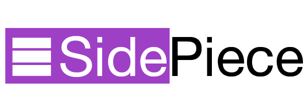

SidePiece is a simple iOS framework for displaying an animated menu appearing from the side of the screen.

## Sample Project

To see SidePiece in action right away, check out the sample project included in this repo.

## Usage
SidePiece centers on the SideViewController. This view controller comes with the additional property `sideView` and the additional method `toggleSideView`. You can subclass this class when making your own interface.

Each time you call `toggleSideView`, the SideViewController will display the side view (if it's not already visible) or hide the side view (if it is already visible).

```swift
// The side view starts out hidden.
mySideViewController.toggleSideView()
// Now, the side view is visible.
mySideViewController.toggleSideView()
// Now, the side view is gone again.
```

By default, you don't need a button that calls `toggleSideView` to hide the side view, since, by default, the SideViewController allows the user to tap away from the side view to hide it. But you can have such a button if you want.

In fact, the side view can display whatever you want. Frequently, this design is used for menus, settings and navigation. But how do you get those aspects of the UI onto the side view?

Simple! You add subviews to your SideViewController's `sideView` property.

```swift
let settingsButton = UIButton(frame: CGRect(x: 50, y: 50, width: 50, height: 50))
settingsButton.backgroundColor = UIColor.blue
mySideViewController.sideView.addSubview(settingsButton)
```

## License
[MIT License](LICENSE)
